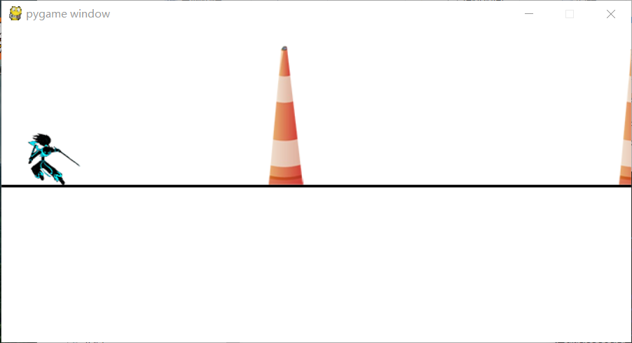
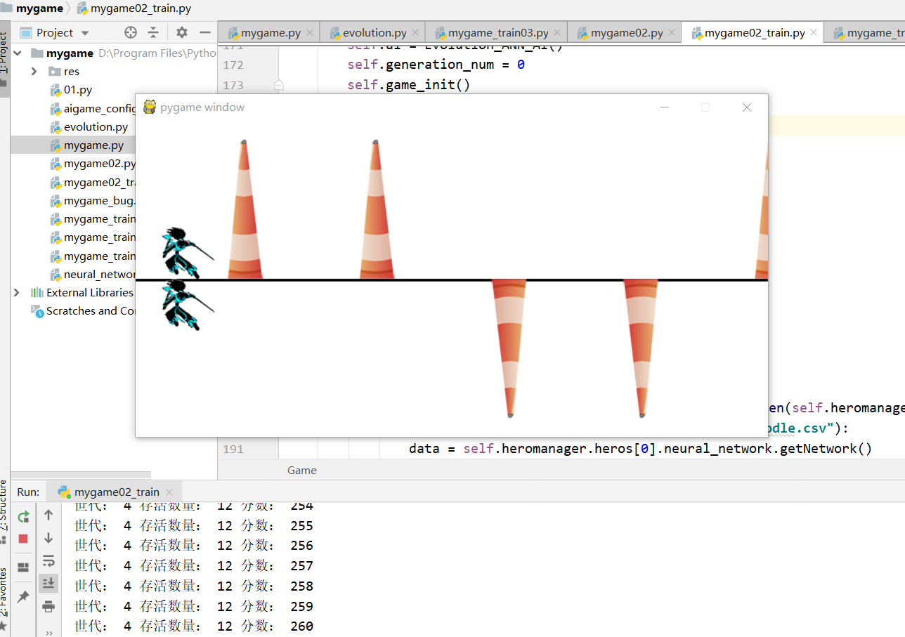

# network_game
基于神经网络的，人工智能游戏训练
## 新增更新
增加一个ai游戏，这是一个利用前面的训练样本中最好的一组样本数据 将其传给ai，让他进行自动游戏操作。其中增加分数显示。
## 内容
其中的2个.py文件，其中一个是设计的一个简单的小游戏（类似忍者必须死），另一个是基于神经网络的人工智能游戏训练，其他的都是搭建的神经网络框架。
点击运行mygame02.py 按空格控制人物上下移动，躲避障碍。    运行mygame02_train.py文件，这是一个人工智能训练文件，他会自动训练人物，控制人物躲避障碍。
使得人物变得越来越聪明，使其进化。最后能够快速且准确的自动躲避障碍。完成训练结果。
## 界面展示
初始game

训练game

新增mygame02_ai.py文件，这是最后训练的得到的结果展示
